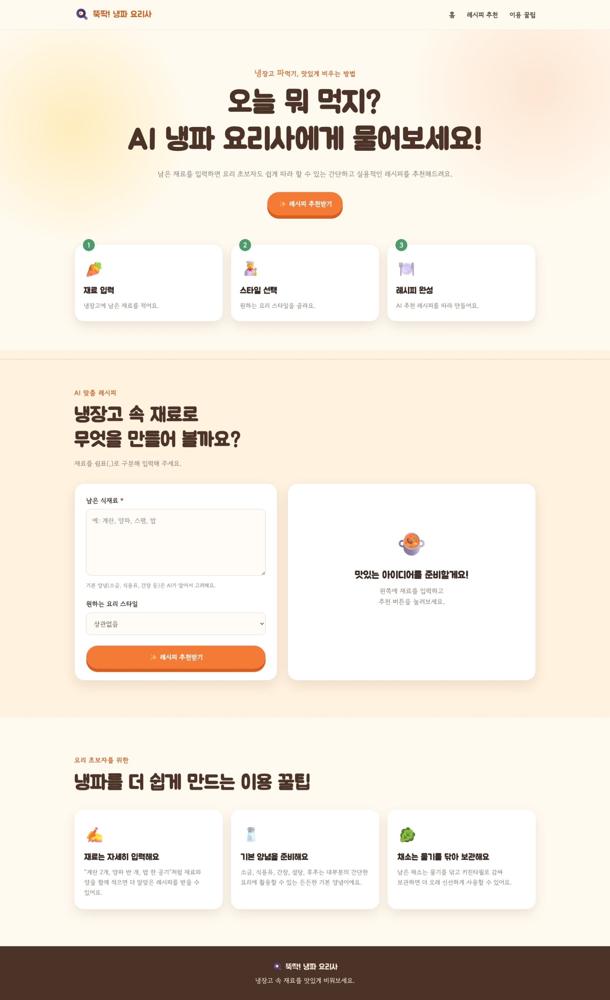
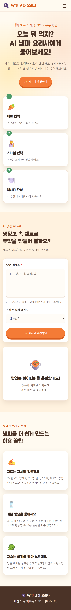
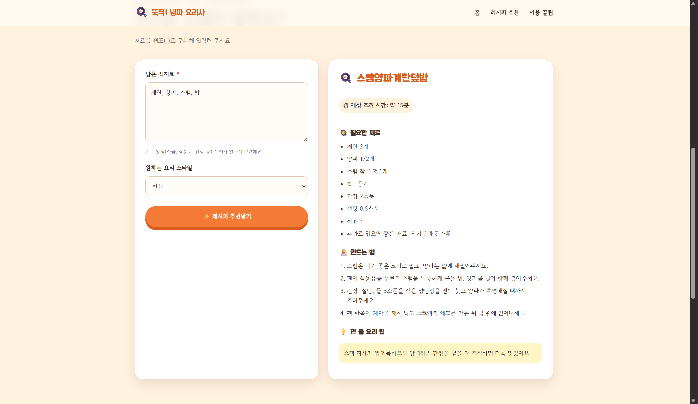
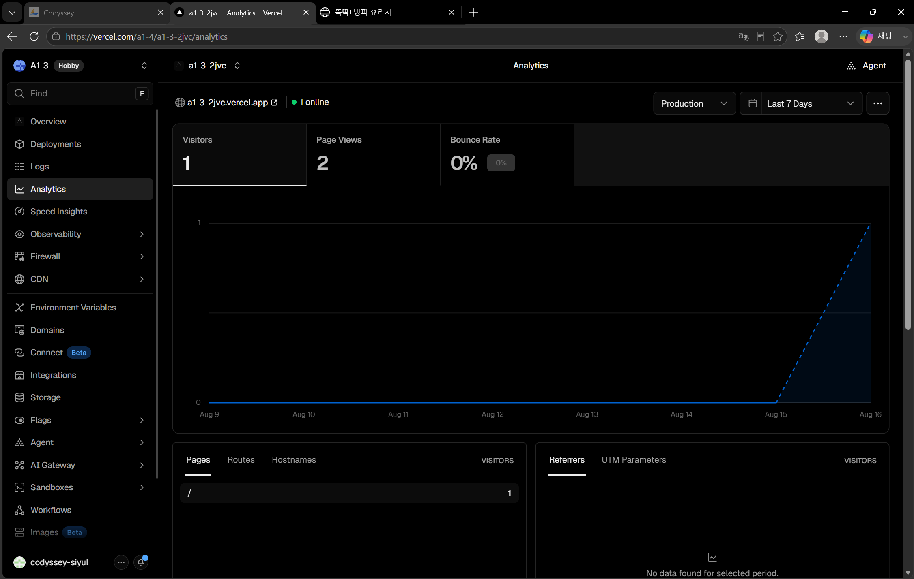
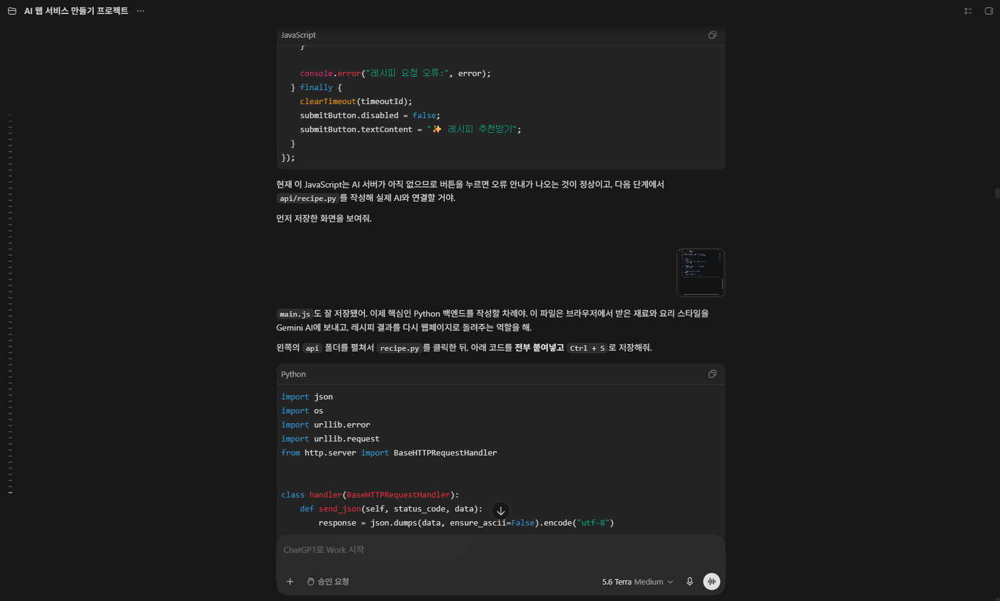
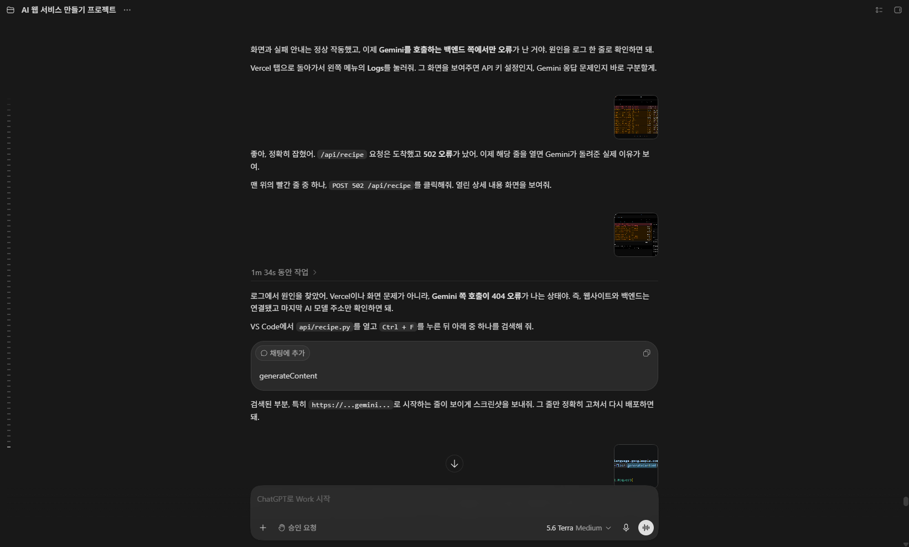

# A1-3 AI 웹 개발: 🍳 뚝딱! 냉파 요리사 (AI 레시피 추천 서비스)

## 1. 서비스 소개
**뚝딱! 냉파 요리사**는 냉장고에 남아 있는 자투리 식재료를 활용하여 음식물 쓰레기를 줄이고, 매일 반복되는 메뉴 고민을 쉽고 재미있게 해결해 주는 AI 맞춤형 레시피 추천 웹 서비스이다. 요리 초보자도 쉽게 따라 할 수 있도록 3~5단계의 간단하고 현실적인 조리법을 제공한다.

## 2. 배포 URL
* **서비스 접속 링크:** [https://a1-3-2jvc.vercel.app/]

## 3. 기술 스택 (Tech Stack)
* **Frontend:** HTML5, CSS3, Vanilla JavaScript
* **Backend:** Python, Vercel Serverless Functions (`/api` 엔드포인트)
* **AI Model:** Google Gemini API
* **Deployment & Version Control:** Vercel, GitHub

## 4. 핵심 기능 및 고도화(보너스) 적용
* **AI 맞춤 레시피 생성:** 사용자가 보유한 식재료와 요리 스타일을 입력하면 Gemini API가 최적의 레시피와 조리 순서를 즉시 생성하여 화면에 출력
* **예외 및 실패 처리:** 
  * 빈 값 입력 시 브라우저 알림창(Alert)을 통한 필수값 입력 유도
  * API 응답 지연 및 서버 오류 시 사용자 안내 메시지 출력
* **사용자 경험(UX) 고도화:** 버튼 호버(Hover) 시 마이크로 인터랙션(색상 변경 및 확대 애니메이션) 적용
* **방문자 분석 환경 구축:** Vercel Web Analytics를 연동하여 실시간 접속자 및 페이지 뷰(Page Views) 트래픽 측정 도입

## 5. 실행 및 배포 방법
1. **GitHub 연동 배포:** 
   * 완성된 코드를 GitHub Repository에 Push한다.
   * Vercel 대시보드에서 해당 Repository를 Import하여 배포(Deploy)한다.
   * 이후 `main` 브랜치에 코드가 푸시될 때마다 자동으로 CI/CD 재배포가 이루어진다.

## 6. 환경 변수(API 키) 설정 방법
이 프로젝트는 AI 호출을 위해 Google Gemini API 키가 필요하며, 보안을 위해 환경 변수로 분리하여 관리

* **로컬 개발 환경:** 
  * 최상위 디렉토리에 `.env` 파일을 생성한다. (단, `.gitignore`에 반드시 포함하여 GitHub에 노출되지 않도록 한다.)
  * `GEMINI_API_KEY=본인의_발급_키` 형태로 작성하여 사용한다.
* **Vercel 배포 환경:** 
  * Vercel 프로젝트 대시보드 접속 ➔ `Settings` ➔ `Environment Variables` 메뉴로 이동
  * Key 항목에 `GEMINI_API_KEY`를, Value 항목에 실제 발급받은 API 키 값을 입력하고 저장한 뒤 재배포
 
## 7. 증빙 자료

### 1) 데스크톱(PC) 화면  

  

### 2) 모바일 반응형 화면

  

### 3) 레시피 추천 기능 동작

### 4) 마이크로 인트랙션 및 Vercel 방문자 분석 연동(보너스 과제)

### 5) AI 코딩 도구 활용 증빙

